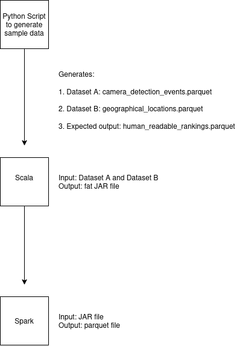

# Camera Detection Analytics - Town of Utopia

## Distributed Computing Tasks I

This project is divided into three logical components:

1. **Sample Data Generation**
   - Repository: [Utopia Generate Sample Data](https://github.com/ZhiCheng-Lucas/utopia_generate_sample_data)
   - Sample data available [here](https://github.com/ZhiCheng-Lucas/utopia_generate_sample_data/tree/main/generate_sample_data/output)

2. **Scala Repository** (Current)
   - Generated sample data: [`./sample_datasets`](./sample_datasets)
   - Main code: [`./src/main/scala/com/utopia/analytics/CameraDetectionAnalytics.scala`](./src/main/scala/com/utopia/analytics/CameraDetectionAnalytics.scala)
   - Data Skew code snippet: [`./data_skew.md`](./data_skew.md)
   - Testing Information: [`./src/test/scala/com/utopia/analytics`](./src/test/scala/com/utopia/analytics)
   - Regarding the requirement for flexible input parameters, please see [Runtime Configuration](#runtime-configuration) section.
   - Note: We are currently writing results to Parquet as a single file using `coalesce(1)` for the sake of simplicity

3. **Compiled Fat JAR File**
   - Available at: [`./camera-detection-analytics-1.0.0.jar`](./camera-detection-analytics-1.0.0.jar)



## Distributed Computing Tasks II

Documentation is available in [`./join.md`](./join.md).

*Note: A PDF version (`./join.pdf`) is also provided, but the markdown file is recommended for optimal formatting.*

## Data Architecture Design

Documentation is available in [`./design.md`](./design.md).

*Note: A PDF version (`./design.pdf`) is also provided, but the markdown file is recommended for optimal formatting.*

## Business Context

As a Data Engineer in this project, you are tasked with processing and analyzing data generated by video cameras equipped with object detection algorithms deployed throughout the Town of Utopia. These cameras identify various objects (people, vehicles, animals, etc.) and record detection events. Management wants to understand which items are most commonly detected across different geographical locations to make informed decisions about urban planning, security, and resource allocation.

## Output Schema Ambiguity

During the implementation of this assignment, I identified an ambiguity in the output requirements that warranted attention. The output schema specification presents conflicting information:

**As specified in the assignment:**

| Column Name | Column Type | Comment |
|-------------|-------------|---------|
| geographical_location | bigint | A unique bigint identifier for the geographical location |
| item_rank | varchar(500) | Item_rank = 1 corresponds to the most popular item detected in geographical_location |
| item_name | varchar(5000) | Item name |

### The Ambiguity

1. **Column Name vs. Column Type Mismatch:**
   - The output column is named "geographical_location" (suggesting the string representation)
   - Yet it's defined with type "bigint" (suggesting the ID)
   - The comment explicitly states it's "A unique bigint identifier"

2. **Business Context vs. Technical Specification:**
   - The business context implies showing meaningful location names to stakeholders ("most popular few items detected... in different geographical locations")
   - The technical specifications explicitly mention implementing a join algorithm and optimizing shuffle stages, which strongly suggests that Dataset B is expected to be used to incorporate location names
   - The scoring criteria specifically states "Bonus marks will be given if you can implement the join algorithm without using .join explicitly," confirming that a join operation is expected

## Handling the Ambiguity

In a real-world scenario, I would seek clarification from stakeholders before proceeding. However, since this is a take-home assignment that may be testing how I handle ambiguity, I've implemented a solution using the geographical_location name (varchar) in the output through `CameraDetectionAnalytics.scala`. This approach:

1. **Aligns with Business Requirements**: Provides stakeholders with meaningful location names rather than numeric IDs, making reports immediately understandable without requiring additional lookups.

2. **Satisfies Technical Requirements**: Implements the join algorithm between Datasets A and B as suggested by the technical specifications and scoring criteria.

3. **Maintains Flexibility**: The core transformation logic could be easily adapted to use location IDs instead if needed, by simply modifying the join operation and final output mapping.

4. **Prioritizes Usability**: While the column type specification suggests using a bigint ID, the business context clearly indicates that meaningful location names are more valuable for making "informed decisions about urban planning, security, and resource allocation."

Note that if the location ID approach were needed instead, the current implementation could be easily modified by removing the join operation and directly using the geographical_location_oid from Dataset A.

## Technical Requirements

### Technology Stack

- Scala 2.13
- Apache Spark 3.5.4
- Spark RDD API
- Spark DataFrame API (allowed only for reading/writing Parquet files)

### Functional Requirements

1. Process camera detection events from Dataset A
2. Join with geographical location data from Dataset B
3. Handle duplicate detection events (count each detection_oid only once)
4. Calculate top X most popular items for each geographical location
5. Output the results in the specified format

### Implementation Constraints

1. Core transformation logic must use only Spark RDD API
2. Must handle duplicate detection_oid values properly
3. Must optimize for data skew in certain geographical locations
4. Must provide configurable parameters for:
   - Input path for Dataset A (detection events)
   - Input path for Dataset B (geographical locations)
   - Output path for results
   - Top X configuration (number of top items to return)

## Data Schema

### Dataset A: Camera Detection Events

**File Format**: Parquet  
**Approximate Size**: 1,000,000 rows  
**Schema**:

| Column Name | Data Type | Description |
|-------------|-----------|-------------|
| geographical_location_oid | bigint | Unique identifier for the geographical location |
| video_camera_oid | bigint | Unique identifier for the video camera |
| detection_oid | bigint | Unique identifier for the detection event |
| item_name | string | Name of the detected item |
| timestamp_detected | bigint | Unix timestamp of detection event |

### Dataset B: Geographical Locations

**File Format**: Parquet  
**Size**: 10000 rows (only first 50 rows used in Dataset A)  in the sample data.
**Schema**:

| Column Name | Data Type | Description |
|-------------|-----------|-------------|
| geographical_location_oid | bigint | Unique identifier for the geographical location |
| geographical_location | varchar(500) | Name of the geographical location |

### Output Dataset: Post-Duplication Rankings

**File Format**: Parquet
**Schema**:

| Column Name | Data Type | Description |
|-------------|-----------|-------------|
| geographical_location | varchar(500)* | Geographical Location* |
| item_rank | varchar(500) | Item rank after deduplication (1 = most popular) |
| item_name | varchar(5000) | Name of the detected item |

*Assumption: We will assume that the data type should be varchar(500) instead of bigint, and that the description should be "Geographical Location" rather than "Unique identifier for the geographical location" as originally specified.*

## Data Relationships Assumptions

- **Location to Camera Relationship**: Each `video_camera_oid` belongs to exactly one `geographical_location_oid` (many-to-one relationship)
- **Dataset Linkage**: Each `geographical_location_oid` in Dataset A corresponds to one entry in Dataset B
- **Geographical Location IDs**: The `geographical_location_oid` in Dataset B is guaranteed to be unique
- **Geographical Location Names**: There might be duplicate `geographical_location` strings in Dataset B (e.g., two different locations with the same name), but we rely on the unique `geographical_location_oid` for identification
- **Detection Events**: A unique `detection_oid` represents a single detection event
- **Duplicate Handling**: There are duplicate `detection_oid` values due to simulated ingestion errors
- **Deduplication Requirement**: The application should count each `detection_oid` only once, even if it appears multiple times in the dataset

## Test Data Generation Parameters

Since the actual datasets are not available, sample test data has been generated with the following parameters:

- Repository: [Utopia Generate Sample Data](https://github.com/ZhiCheng-Lucas/utopia_generate_sample_data)

### Dataset A Parameters

- **Geographical Locations**: 50 unique locations (with IDs 1-50)
- **Cameras per Location**: 5-20 cameras (varies by location, assigned sequential IDs)
- **Detectable Items**: 100 different realistic items (e.g., "person", "car", "dog", "bicycle")
- **Time Range**: Sequential timestamps (each increment in detection_oid corresponds to 1 second increase)
- **Item Distribution**: Follows a power law distribution (some items are much more common than others)
- **Data Skew**: Location ID 42 has 5x the average number of detections
- **Duplicate Generation**:
  - In locations 10 and 20: The second most common item is duplicated enough to make it rank first if duplicates are counted
  - In all other locations: The most common item is duplicated (doesn't change ranking)

### Dataset B Parameters

- **Location Types**: Urban areas, suburbs, rural locations, commercial districts, etc.
- **Naming Convention**: "{Type} {Number}" (e.g., "Urban Area 7", "Commercial District 12")
- **Note**: Only 100 rows are generated for Dataset B, with the first 50 being used in Dataset A

## Special Case: Data Skew

To test the optimization requirement for handling data skew, the location with ID 42 will have a significantly higher number of detections than other locations (approximately 5x the average). This represents a high-traffic area with many more detection events.

- Data Skew code snippet: [`./data_skew.md`](./data_skew.md)

## Runtime Configuration

The main class of the application provides flexibility to configure the following parameters at runtime:

1. **Input path for Dataset A (Parquet File 1)** - Path to the detection events data
2. **Input path for Dataset B (Parquet File 2)** - Path to the geographical locations data
3. **Output path for results (Parquet File 3)** - Destination path for the generated rankings
4. **Top X configuration** - Number of top items to be considered (e.g., setting this to 10 will return the top 10 most detected items for each location)

## Building the Project

The project uses SBT to build a "fat JAR" that includes all dependencies:

```bash
# Navigate to the project root directory
cd utopia_spark_scala

# Build the fat JAR
sbt clean assembly
```

This will create a JAR file at `target/scala-2.13/camera-detection-analytics-1.0.0.jar`.

## Running the Application

You can run the application using `spark-submit`:

```bash
spark-submit \
  --class com.utopia.analytics.CameraDetectionAnalytics \
  --master <master-url> \
  target/scala-2.13/camera-detection-analytics-1.0.0.jar \
  <detection_events_path> \
  <geographical_locations_path> \
  <output_path> \
  [top_n]
```

### Parameters

- `<master-url>`: Spark master URL (e.g., `local[*]` for local mode with all available cores)
- `<detection_events_path>`: Path to the detection events Parquet file (Dataset A)
- `<geographical_locations_path>`: Path to the geographical locations Parquet file (Dataset B)
- `<output_path>`: Path where the output rankings Parquet file will be written
- `[top_n]`: (Optional) Number of top items to return per location (default: 10)

### Example

Here's an example command for running the application with local data:

```bash

/home/laptop-linux-26feb/Desktop/spark-3.5.4-bin-hadoop3-scala2.13/bin/spark-submit \
 --class com.utopia.analytics.CameraDetectionAnalytics \
--master local[*] \
 target/scala-2.13/camera-detection-analytics-1.0.0.jar \
/home/laptop-linux-26feb/Desktop/utopia_spark_scala/src/main/resources/camera_detection_events.parquet \
 /home/laptop-linux-26feb/Desktop/utopia_spark_scala/src/main/resources/geographical_locations.parquet \
/home/laptop-linux-26feb/Desktop/utopia_scala_repo/output \
10


```

This will process the detection events and locations, calculating the top 10 most detected items for each location.

## Testing

For testing details, please refer to:
[`./src/test/scala/com/utopia/analytics/test_documentaion.md`](./src/test/scala/com/utopia/analytics/test_documentaion.md)
