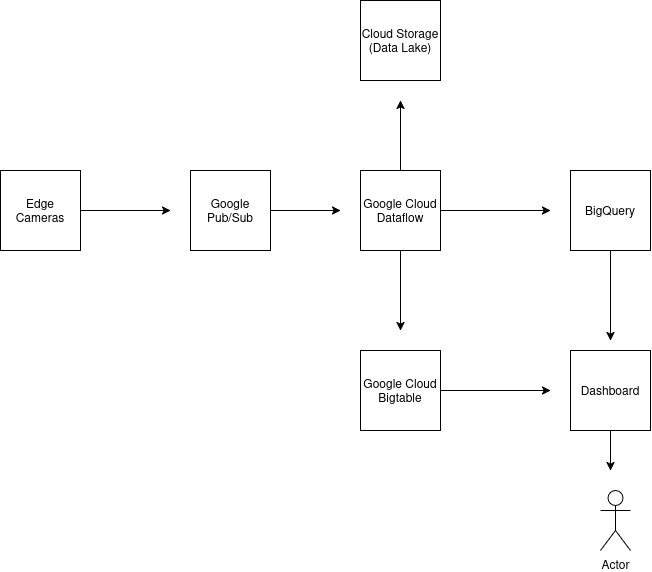

# Real-Time Camera Detection Analytics Architecture Design

## 1. Executive Summary

This document outlines a architecture design for processing and visualizing camera detection data from the Town of Utopia. The system will ingest ~10,000 events per second from video cameras, process them in real-time (deduplicating and joining with location data), and make the results available for immediate visualization through a dashboard.

## 2. System Requirements Analysis

### 2.1 Functional Requirements

1. Ingest streaming data from video cameras (~10,000 events/second)
2. Join streaming data (Dataset A) with static geographical data (Dataset B)
3. Deduplicate events that may occur due to upstream retries
4. Make joined results available immediately for dashboard visualization
5. Maintain historical data for trend analysis and auditing

### 2.2 Non-Functional Requirements

1. **Scalability**: Handle peak loads exceeding 10,000 events/second
2. **Latency**: Dashboard should reflect new events within seconds
3. **Reliability**: No data loss, even during system component failures
4. **Fault Tolerance**: System should continue operating during partial outages
5. **Cost Efficiency**: Optimize resource usage for processing and storage

## 3. Questions for End Users/PM

Before finalizing the design, I would ask the following critical questions:

### 3.1 Data Characteristics

1. What is the exact schema of the streaming events? Any additional fields beyond what's in Dataset A?
2. What is the expected growth rate of events over time?
3. What is the average and maximum size of each event?
4. What is the estimated duplicate rate in the incoming stream?
5. How frequently does Dataset B (geographical locations) change, if at all?

### 3.2 Processing Requirements

1. What is the maximum acceptable latency for events to appear on the dashboard?
2. Are there any specific time windows for aggregations (hourly, daily, etc.)?
3. Is exactly-once processing mandatory, or is at-least-once with deduplication sufficient?
4. Are there any specific business rules for handling duplicates beyond simple detection_oid matching?

### 3.3 Dashboard and Visualization

1. Who are the primary users of the dashboard (technical analysts, executives, operators)?
2. What are the key metrics and visualizations required?
3. Is historical data exploration required, or only real-time views?
4. What are the data retention requirements for different time granularities?
5. Are there any alerting requirements based on certain conditions?

## 4. Architecture Design

I propose a cloud-based architecture using Google Cloud Platform (GCP). The architecture could be adapted to AWS or Azure with equivalent services.

### 4.1 High-Level Architecture Diagram

### 4.2 Component Details

#### 4.2.1 Ingestion Layer

**Google Cloud Pub/Sub**

- Serverless message queue for real-time event ingestion
- Can handle >10,000 messages per second with automatic scaling
- Provides at-least-once delivery guarantee
- Maintains ordering within partitions
- Supports message retention for replay if needed

**Why this tech:**

- Handles high throughput with low latency
- Decouples producers from consumers
- Provides buffering during processing spikes
- Enables multiple downstream consumers
- Auto-scales without provisioning

#### 4.2.2 Processing Layer

**Google Cloud Dataflow (Apache Beam)**

- Fully managed stream and batch processing service
- Provides exactly-once processing semantics
- Supports event-time windowing and watermarks
- Enables complex transformations including joins, aggregations, and deduplication

**Processing Pipeline Steps:**

1. Read events from Pub/Sub
2. Apply windowing (tumbling windows of 5-10 seconds)
3. Deduplicate based on detection_oid
4. Join with Dataset B (geographical locations, loaded as side input)
5. Compute aggregations and metrics
6. Write results to multiple sinks

**Why this tech:**

- Unified programming model for batch and streaming
- Auto-scaling and auto-healing
- Built-in support for handling late data
- Exactly-once processing guarantees
- Native GCP integration

#### 4.2.3 Storage Layer

**Multiple storage solutions for different access patterns:**

**Google Cloud Bigtable**

- NoSQL database for real-time serving
- Store recent processed events (last 24 hours) for low-latency access
- Schema designed for dashboard queries (row key: location_id + timestamp)

**Google BigQuery**

- Serverless data warehouse for analytics
- Store all processed events for historical analysis
- Enable SQL queries for ad-hoc analysis and reporting

**Google Cloud Storage**

- Object storage for data lake
- Store raw events for reprocessing if needed
- Cost-effective long-term storage

**Why this tech combination:**

- Bigtable: sub-10ms latency for dashboard queries
- BigQuery: unlimited scale for analytics queries
- Cloud Storage: low-cost archival with high durability

#### 4.2.4 Visualization Layer

**Looker (or Google Data Studio)**

- Business intelligence and data visualization platform
- Create interactive dashboards with near real-time updates
- Support for custom visualizations and metrics

**Why this tech:**

- Native integration with BigQuery and Bigtable
- Support for real-time data refreshes
- Rich visualization capabilities
- Role-based access control

### 4.3 Data Flow

1. **Ingestion**: Camera systems publish detection events to Cloud Pub/Sub topics
2. **Processing**:
   - Dataflow reads messages from Pub/Sub
   - Applies windowing (5-10 second windows)
   - Deduplicates events based on detection_oid
   - Loads Dataset B as a side input (cached and refreshed periodically)
   - Joins events with location data
   - Computes metrics and aggregations
3. **Storage**:
   - Recent processed data written to Bigtable for low-latency access
   - All processed data written to BigQuery for analytics
   - Raw data archived to Cloud Storage
4. **Visualization**:
   - Looker dashboards connect to Bigtable for near real-time views
   - Historical trend dashboards connect to BigQuery

## 5. Key Technical Considerations

### 5.1 Handling Duplicates

To handle duplicate events, I propose a multi-stage approach:

1. **Window-Based Deduplication**:
   - Group events by detection_oid within fixed time windows
   - Keep only the first occurrence of each detection_oid

2. **Global Deduplication** (additional safety):
   - Maintain a sliding window of recent detection_oids in Redis/Memorystore
   - Check new events against this cache before processing

3. **Idempotent Processing**:
   - Design downstream processing to be idempotent
   - Ensure visualizations aggregate correctly even with rare duplicates

### 5.2 Scalability Considerations

1. **Horizontal Scaling**:
   - Pub/Sub and Dataflow auto-scale based on throughput
   - Bigtable scales horizontally for increased query load

2. **Handling Traffic Spikes**:
   - Pub/Sub buffers incoming messages during spikes
   - Dataflow dynamically adjusts worker count

3. **Regional/Multi-Regional Deployment**:
   - Deploy in multiple regions for disaster recovery
   - Use global Pub/Sub topics for geo-redundancy

### 5.3 Data Consistency and Availability

1. **Consistency Model**:
   - Pub/Sub: at-least-once delivery
   - Dataflow: exactly-once processing
   - Bigtable: strong consistency for row reads
   - BigQuery: strong consistency for queries

2. **Availability Design**:
   - No single point of failure in the architecture
   - Automatic failover for all components
   - Data replication across zones/regions

### 5.4 Latency Optimization

To achieve low dashboard latency:

1. **Processing Optimizations**:
   - Small processing windows (5-10 seconds)
   - Parallel processing across many workers
   - Efficient state management in Dataflow

2. **Storage Optimizations**:
   - Bigtable schema optimized for dashboard query patterns
   - Pre-aggregation of common metrics
   - Denormalization of frequently accessed data

3. **Visualization Optimizations**:
   - Incremental dashboard updates
   - Efficient client-side caching
   - Progressive loading of visualizations

## 6. Alternative Technology Considerations

### 6.1 Alternative Cloud Platforms

**Amazon Web Services (AWS)**:

- Kinesis instead of Pub/Sub
- Kinesis Data Analytics/Lambda instead of Dataflow
- DynamoDB instead of Bigtable
- Redshift/Athena instead of BigQuery
- QuickSight instead of Looker

**Microsoft Azure**:

- Event Hubs instead of Pub/Sub
- Stream Analytics/Databricks instead of Dataflow
- Cosmos DB instead of Bigtable
- Synapse Analytics instead of BigQuery
- Power BI instead of Looker
